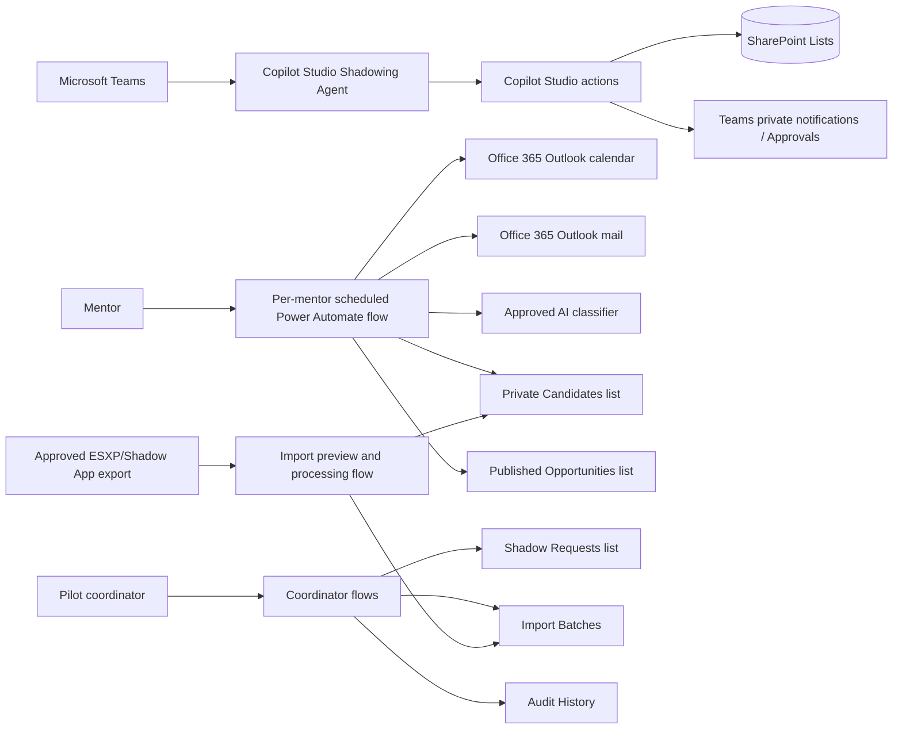
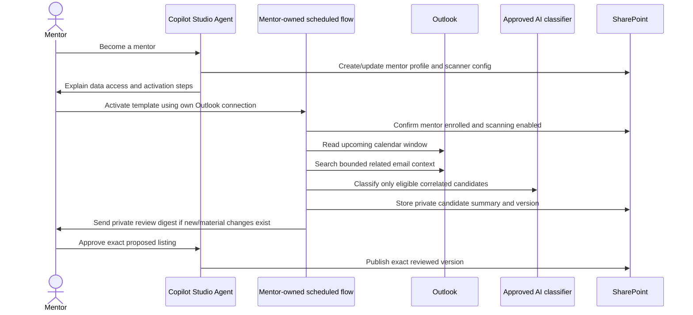
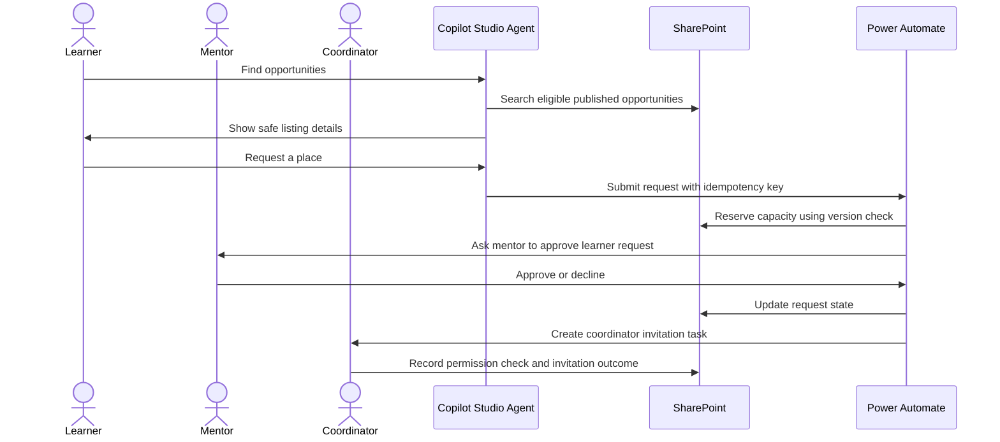

# Architecture and journeys

## System architecture

## Mentor automated discovery journey

## Learner request and coordinator journey

## Role boundaries

| Role | Allowed actions |
| --- | --- |
| Learner | Manage learner profile, search published opportunities, request/withdraw own place, view own request status, pause recommendations. |
| Mentor | Manage mentor profile, scanning preferences, private candidates, own listings, and requests for own listings. |
| Pilot coordinator | Review mentor-approved requests, check attendance permissions, coordinate invitations with authorized organizer, manage imports and operational issues. |
| Administrator | Configure lists, permissions, retention, environments, DLP-compatible connectors, and flows. |

Authorization is derived from authenticated identity and Entra/SharePoint group membership. Email address, mentor ID, opportunity ID, role, or approval payload values supplied by chat are never trusted as proof of authorization.

